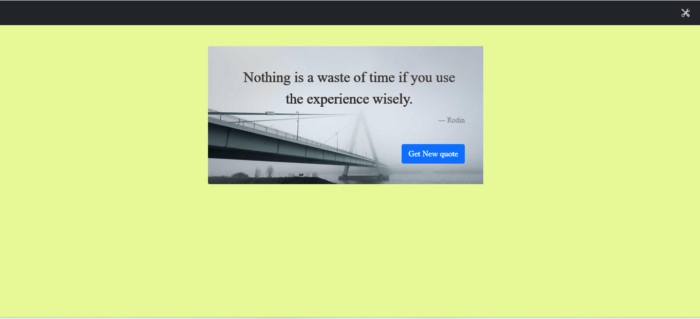

# Interview Exercise Web
This application is a .NET Core 6 web application that displays random quotes and images from http://forismatic.com/en/api/ and https://picsum.photos/.

## Requirements

To run this application, you will need to have the following installed on your machine:
- .NET 6 SDK.
- Visual Studio 2022 (optional)

## Installation

Clone the repo with the following command:
```bash
   git clone https://github.com/kksnamboothiri/interview-exercise.git
   ```
Move to the interviewExercise.Web folder and type dotnet run in a terminal window to launch the application.
Point your browser to the https://localhost:7180 address. You should see a web page like the following:




## Usage
The "Get new quotes" button will reload a new quote and image. The "Settings" button on the top right corner will enable changing the image to grayscale. Clicking the button will create an AJAX request to the controller, and HttpClient is used to get the API results. The images are converted to a base64 string and passed to JavaScript.

## Technologies Used

- .NET Core 6.
- ASP.NET Core MVC
- Bootstrap
- jQuery
