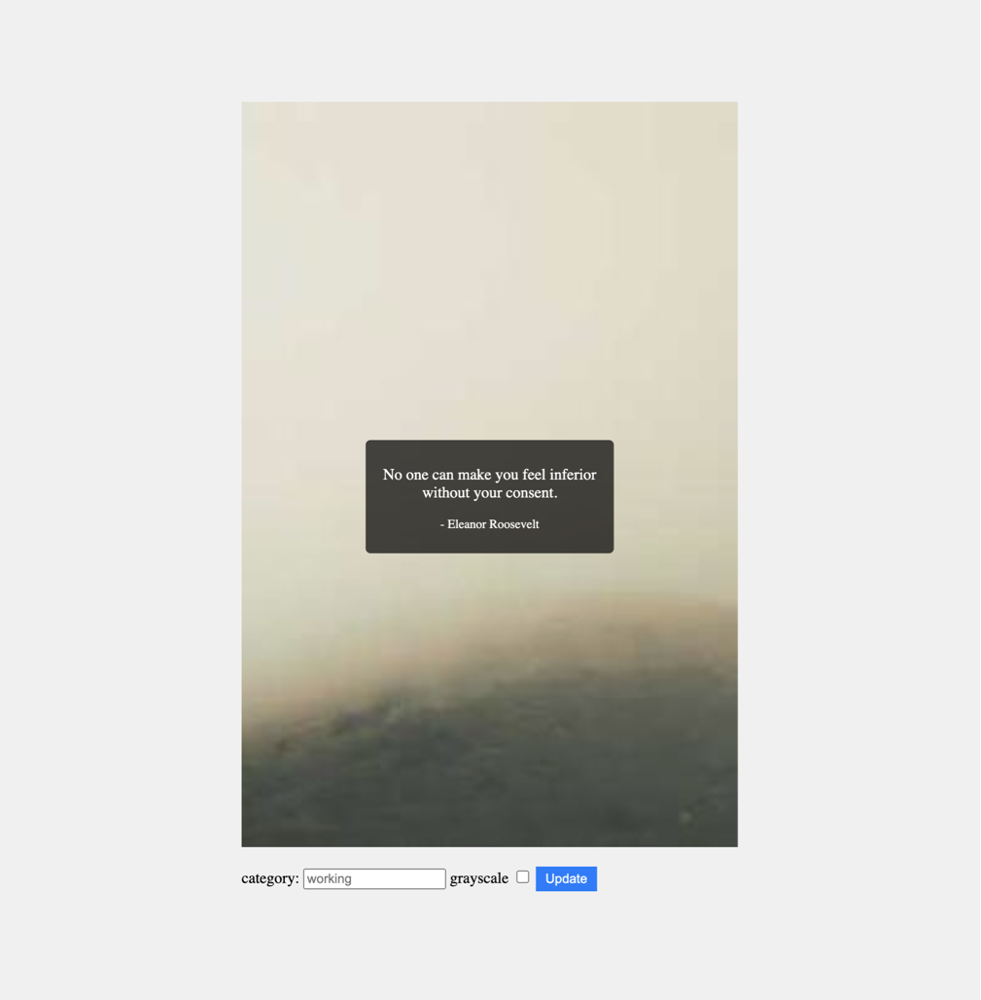

# Setting Up and Testing a Quote Web App and CLI Tool

This guide will walk you through the steps to set up and test a web app and a CLI tool that display a random quote along with an image. The application can retrieve quotes and images from two different APIs. You can also specify a category for the quote (with a default if not specified) and choose to display a grayscale image. The application is designed to be resilient, even if one or both of the data providers are unavailable. This guide also covers unit tests and provides documentation for your understanding.

## Purpose

The purpose of this application is to create a small web app and a command-line interface (CLI) tool that allows users to retrieve a random quote and an image. The application interfaces with external APIs to provide the content and offers flexibility in specifying a quote category and image style.

The web app provides a visual interface for the user to retrieve quotes and images interactively. 

The CLI tool provides a command-line interface for the user to retrieve quotes and images programmatically. It saves the quote and image to a text file and an image file, respectively, based on the parameters provided.

## Pre-requisites
- Python 3.8 or higher

This application was built and tested using MacOS Ventura 13.1 and Python 3.9 and some of the commands contained in this guide may not work on other operating systems. Make adjusts accordingly.

## Web App



### Step 1: Install Dependencies

```bash
# Install virtualenv (if not already installed)
python -m pip install virtualenv

# Create a virtual environment for the web app
python -m virtualenv web-env

# Activate the virtual environment
source web-env/bin/activate

# Install web app dependencies
pip install -r web/requirements.txt
```

### Step 2: Run the Web App

```bash
# Activate the virtual environment (if not already activated)
source web-env/bin/activate

# Run the web app
uvicorn web.main:app --reload
```

Open your browser of preference using the following url: http://localhost:8000/

To stop the web app, press `Ctrl+C` in the terminal window where you ran the web app.

### Step 3: Run Web App Unit Tests

```bash
# Activate the virtual environment (if not already activated)
source test-env/bin/activate

# Set PYTHONPATH
export PYTHONPATH=$PWD

# Run web app unit tests
pytest tests/web
```

## CLI Tool

### Step 1: Install Dependencies

```bash
# Install virtualenv (if not already installed)
python -m pip install virtualenv

# Create a virtual environment for the CLI tool
python -m virtualenv cli-env

# Activate the virtual environment
source cli-env/bin/activate

# Install CLI tool dependencies
pip install -r cli/requirements.txt
```

### Step 2: Run the CLI Tool

```bash
# Activate the virtual environment (if not already activated)
source cli-env/bin/activate

# Run the CLI tool
python cli/quote.py
```

### Step 3: Run the CLI Tool with Parameters

```bash
# Activate the virtual environment (if not already activated)
source cli-env/bin/activate

# Run the CLI tool with parameters
python cli/quote.py --category sane --grayscale --output my_quote.txt --output-image my_image.jpg
```

### Step 4: Run CLI Tool Unit Tests

```bash
# Activate the virtual environment (if not already activated)
source test-env/bin/activate

# Set PYTHONPATH
export PYTHONPATH=$PWD

# Run CLI tool unit tests
pytest tests/cli
```

## Resilience and Error Handling

This application is designed to handle scenarios where one or both of the external providers for quotes and images are unavailable. Appropriate error handling is in place to ensure a smooth user experience even in such cases.

## Alternative execution methods

You can also install dependencies, test and run the WEB application and CLI tool using the makefile located in the root folder of the repository. The makefile also includes a target to run the unit tests for all modules.

### Quote Web app using make commands
```bash
# Install dependencies for the web application
make install-web

# Run the web app
make run-web-server

# Run web app unit tests
make web-unit-test
```

### CLI tool using make commands
```bash
# Install dependencies for the CLI tool
make install-cli
# Run the CLI tool using default parameters
make run-cli
# Run the CLI tool with additional parameters
make run-cli-params
# Run CLI tool unit tests
make cli-unit-test
```

### Run all unit tests using make commands
```bash
# Install test dependencies
make install-unit-test

# run all tests
make unit-test
```

## Conclusion

Congratulations! You've set up and tested both the Quote Web App and the CLI tool. Feel free to explore the documentation and make any improvements or customizations as needed.


